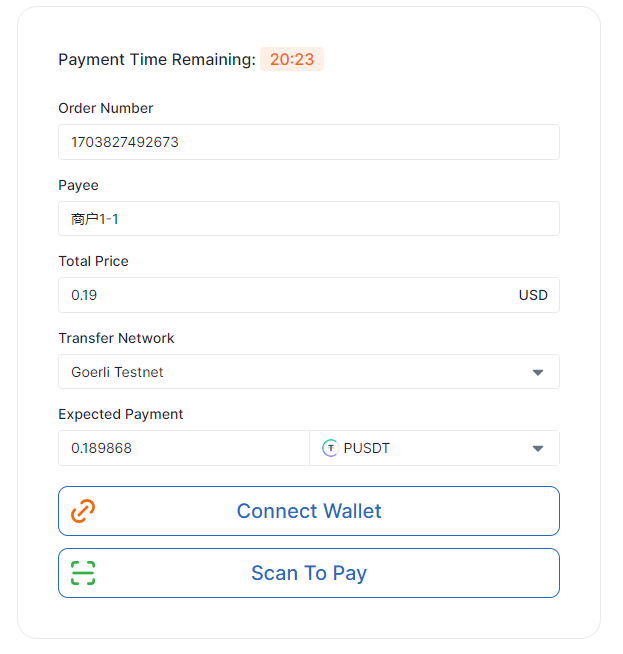
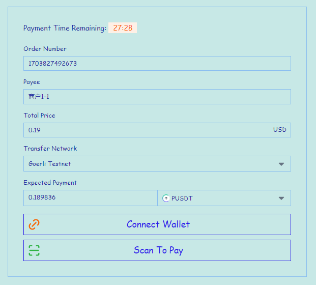

# Pay Elements

English | [简体中文](./README.zh-CN.md)


A javascript SDK for embedding PayProtocol payment page in your website or app. Support mainstream modern browsers.


## Quick Start

Get the [latest release](https://github.com/UtcPayProtocol/utcpay-elements/releases/latest) from GitHub, download and unzip the pay-elements.zip file, and put the contents of the unzipped files into your project directory.

We provide two modularized versions of ESM and UMD. You can choose the appropriate version according to your project needs.

Pay Elements SDK needs to be used with PayProtocol merchant API. You can view how to [create a payment order](https://doc.payprotocol.network/merchant/payment#create-payment-order) in [PayProtocol Docs](https://doc.payprotocol.network).

### ESM

If your project uses ESM modularization, you can directly import the `pay-elements.js` file and css file. ESM supports both native HTML and React, Vue and other frameworks.

#### Vanilla HTML

```html
<!doctype html>
<html lang="en">

<head>
  <meta charset="UTF-8" />
  <meta name="viewport" content="width=device-width, initial-scale=1.0" />
  <title>Your website title</title>
  <script type="module">
    // Import pay-elements.js
    import PayElements from './pay-elements.js';
    // Parse apiSign in paymentUrl, paymentUrl is returned from PayProtocol merchant API when creating a payment order
    const paymentUrl = '/payment?apiSign=gKLedHpHBzAmVMNq1cVgox7QGrwg%2FYH8Igp0%2Fv1GX3c%3D';
    const encondedApiSign = paymentUrl.split('=')[1];
    const apiSign = decodeURIComponent(encondedApiSign);
    // Initialize configuration
    const Payment = new PayElements({
      apiSign: apiSign,
      // Id of the mount node
      root: 'payment',
      // Whether to use the sandbox environment
      sandbox: true,
    });
    // Mount
    Payment.mount();
    // Call updateApiSign method if you want to update apiSign
    // let newApiSign = '...';
    // Payment.updateApiSign(newApiSign);
  </script>
  <!-- Import pay-elements.css -->
  <link rel="stylesheet" href="./pay-elements.css">
</head>

<body>
  <!-- Provide a mount node -->
  <div id="payment"></div>
</body>

</html>
```

#### Use with React

```jsx
import { useEffect } from "react";
import UtcPayElements from "./pay-elements.js";
import "./pay-elements.css";

export default function Payment() {
  useEffect(() => {
    // Parse apiSign in paymentUrl, paymentUrl is returned from PayProtocol merchant API when creating a payment order
    const paymentUrl = '/payment?apiSign=gKLedHpHBzAmVMNq1cVgox7QGrwg%2FYH8Igp0%2Fv1GX3c%3D';
    const encondedApiSign = paymentUrl.split('=')[1];
    const apiSign = decodeURIComponent(encondedApiSign);
    // Initialize configuration
    const Payment = new PayElements({
      apiSign: apiSign,
      // Id of the mount node
      root: 'payment',
      // Whether to use the sandbox environment
      sandbox: true,
    });
    // Mount
    Payment.mount();
  }, []);

  return <div id="payment" />;
}
```

### UMD

if your project uses UMD modularization, you can directly import the `pay-elements.umd.cjs` file and css file.

```html
<!doctype html>
<html lang="en">

<head>
  <meta charset="UTF-8" />
  <meta name="viewport" content="width=device-width, initial-scale=1.0" />
  <title>Your website title</title>
  <!-- Import pay-elements.umd.cjs -->
  <script src="./pay-elements.umd.cjs"></script>
  <!-- Import pay-elements.css -->
  <link rel="stylesheet" href="./pay-elements.css">
</head>

<body>
  <!-- Provide a mount node -->
  <div id="payment"></div>
  <!-- The script needs to be executed after the mount node is loaded -->
  <script>
    // Parse apiSign in paymentUrl, paymentUrl is returned from PayProtocol merchant API when creating a payment order
    const paymentUrl = '/payment?apiSign=gKLedHpHBzAmVMNq1cVgox7QGrwg%2FYH8Igp0%2Fv1GX3c%3D';
    const encondedApiSign = paymentUrl.split('=')[1];
    const apiSign = decodeURIComponent(encondedApiSign);
    // Initialize configuration
    const Payment = new PayElements({
      apiSign: apiSign,
      // Id of the mount node
      root: 'payment',
      // Whether to use the sandbox environment
      sandbox: true,
    });
    // Mount
    Payment.mount();
    // Call updateApiSign method if you want to update apiSign
    // let newApiSign = '...';
    // Payment.updateApiSign(newApiSign);
  </script>
</body>

</html>
```

## Notice

- If the user has not installed any Web3 wallet, the payment cannot be completed.
- If the user has not completed the payment within the specified time, they will be guided back to the previous page to re-order or select the payment method.
- If the user pays successfully, they will be guided to the `redirectionUrl` specified when creating the order. At the same time, PayProtocol will send the payment result to the `notifyUrl` you specified. You can also get the payment result by polling the order information with the merchant API.

## API

### PayElements Class

#### Constructor

```typescript
new PayElements(options: PayElementsOptions)
```

Create a PayElements instance.

#### Parameters

- `options` - `PayElementsOptions` type, configuration options.

The `PayElementsOptions` type is defined as follows:

| Parameter         | Type          | Reqired | Default  | Description                                                                                                                                                                                                                                                                                                                                    |
| ----------------- | ------------- | ------- | -------- | ---------------------------------------------------------------------------------------------------------------------------------------------------------------------------------------------------------------------------------------------------------------------------------------------------------------------------------------------- |
| apiSign           | string        | Yes     | None     | The apiSign parsed from the paymentUrl returned by the PayProtocol merchant API when creating a payment order, the apiSign of each order is unique                                                                                                                                                                                             |
| root              | string        | Yes     | None     | Id of the HTML mount node                                                                                                                                                                                                                                                                                                                      |
| sandbox           | boolean       | No      | false    | Whether to use the sandbox environment, if true, the sandbox environment will be used, otherwise the production environment will be used.                                                                                                                                                                                                      |
| defaultLanguage   | string        | No      | None     | Default language setting. Currently built-in support for `en-US` and `zh-CN`. If not filled in, the user's browser language will be recognized. If you want to add other languages, you can refer to the following.                                                                                                                            |
| customTheme       | ThemeOverride | No      | None     | Custom theme, if not passed, the default theme will be used, you can refer to the following for the specific content that can be overridden.                                                                                                                                                                                                   |
| ~~customCKTheme~~ | ~~any~~       | ~~No~~  | ~~None~~ | ~~Pay Elements uses [ConnectKit](https://docs.family.co/connectkit) to connect to the Ethereum wallet. You can customize the theme of the ConnectKit components. If not passed, the default theme will be used. You can refer to the [customTheme](https://docs.family.co/connectkit/api-reference#connectkitprovider-customtheme) document.~~ |

#### Methods

##### mount

```typescript
mount(): void
```

Mount payment page.

##### updateApiSign

```typescript
updateApiSign(newApiSign: string): void
```

Update apiSign and re-render the payment page.

## Custom Theme

### Basic Customization

You can simply customize the theme of the payment page by setting the `customTheme` parameter.

For example:
```typescript
const Payment = new PayElements({
  apiSign,
  root: 'payment',
  customTheme: {
    colorPrimary: '#2D20E8',
    colorBackground: '#C7E8E6',
    colorText: '#232CA0',
    fontFamily: 'Comic Sans MS',
    fontSizeBase: '14px',
    spacingUnit: '3px',
    borderRadiusBase: '0px',
    colorBorder: '#8ABEF0',
  },
})
```



All customizable theme properties are as follows (the type of property value must conform to the CSS specification, the type is string or number):

| Property Name          | Default Value                                              | Description                                                                                                         |
| ---------------------- | ---------------------------------------------------------- | ------------------------------------------------------------------------------------------------------------------- |
| fontFamily             | 'Inter', system-ui, 'Avenir', Helvetica, Arial, sans-serif | Font, may need to provide font files separately                                                                     |
| fontSizeBase           | 16px                                                       | Base font size, will override the font size of the HTML root node                                                   |
| fontSizeSm             | 0.875rem                                                   | Small font size, used for internal elements and secondary text                                                      |
| fontSizeLg             | 1.25rem                                                    | Large font size, used for titles and other content                                                                  |
| lineHeightNone         | 1                                                          | 1 times line height                                                                                                 |
| lineHeightTight        | 1.25                                                       | 1.25 times line height, used for compact content                                                                    |
| lineHeightNormal       | 1.5                                                        | 1.5 times line height, used for normal text display                                                                 |
| spacingUnit            | 0.25rem                                                    | Spacing unit, the margin and padding values of all elements are multiples of this unit (0, 1, 2, 3, 4, 5, 6, 8, 10) |
| borderWidth            | 1px                                                        | Border width                                                                                                        |
| borderRadiusBase       | 0.25rem                                                    | Base border radius, minimum size                                                                                    |
| borderRadiusMd         | 2.5 times of borderRadiusBase                              | Medium border radius, used for large size buttons and other elements                                                |
| borderRadiusLg         | 5 times of borderRadiusBase                                | Large border radius, used for modals and other elements                                                             |
| borderRadiusPill       | 200 times of borderRadiusBase                              | Pill border radius, used for pill buttons and other elements                                                        |
| colorPrimary           | #206bc4                                                    | Theme color or brand color                                                                                          |
| colorPrimaryLight      | rgba(192, 218, 247, 0.28)                                  | Lighter theme color, used for element background or hover state                                                     |
| colorBackground        | #ffffff                                                    | Background color                                                                                                    |
| colorText              | #182433                                                    | Text color                                                                                                          |
| colorTextSecondary     | #6673b2                                                    | Secondary text color                                                                                                |
| colorDanger            | #d63939                                                    | Danger color                                                                                                        |
| colorDangerLight       | #fbebeb                                                    | Lighter danger color                                                                                                |
| colorWarning           | #f76707                                                    | Warning color                                                                                                       |
| colorWarningLight      | #fefoe6                                                    | Lighter warning color                                                                                               |
| colorSuccess           | #2fb344                                                    | Success color                                                                                                       |
| colorSuccessLight      | #eaf7ec                                                    | Lighter success color                                                                                               |
| colorInputShadow       | #accaed                                                    | Shadow color when input box is focused                                                                              |
| colorModalShadow       | rgba(131, 186, 219, 0.2)                                   | Shadow color of modals                                                                                              |
| colorBackdrop          | rgba(131, 186, 219, 0.2)                                   | Background color of modal mask                                                                                      |
| colorBorder            | #eaeaea                                                    | Border color                                                                                                        |
| modalZIndex            | 500                                                        | z-index of modals                                                                                                   |
| colorBackgroundDark    | #000000                                                    | Background color in dark mode                                                                                       |
| colorTextDark          | #f6f6f6                                                    | Text color in dark mode                                                                                             |
| colorTextSecondaryDark | #858585                                                    | Secondary text color in dark mode                                                                                   |
| colorBorderDark        | #686868                                                    | Border color in dark mode                                                                                           |

### Deep Customization

You can deeply customize the theme of the payment page by modifying the `pay-elements.css` file or overriding the relevant styles.

## Add Localization Packs

Pay Elements supports multiple languages, currently built-in support for `en-US` and `zh-CN`. If you want to add other languages, follow these steps:

1. In the `locales/config.json` file, add a new language configuration, the format is `"ISO standard language code": "The name of the language in this language"`. For example:

```json
{
  "en-US": "English",
  "zh-CN": "简体中文",
  "ja-JP": "日本語",
  "th-TH": "ไทย",
}
```

2. Create a new folder for the corresponding language in the `locales` directory, such as `ja-JP`, and then create a `translation.json` file. Refer to the existing Chinese and English translation files and add the corresponding translation. Note to keep the key unchanged and only modify the value.

The directory structure is as follows:

```
|--locales
  |--config.json
  |--en-US
    |--translation.json
  |--zh-CN
    |--translation.json
  |--ja-JP
    |--translation.json
  |--th-TH
    |--translation.json
```

## License

MIT
